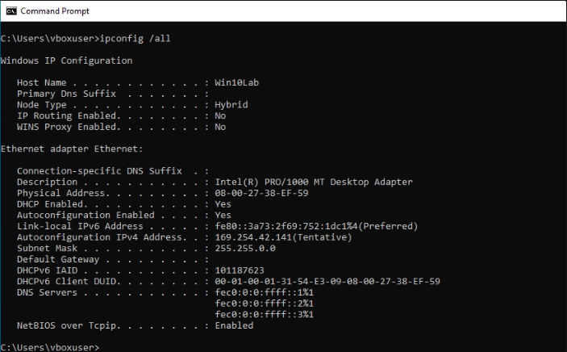
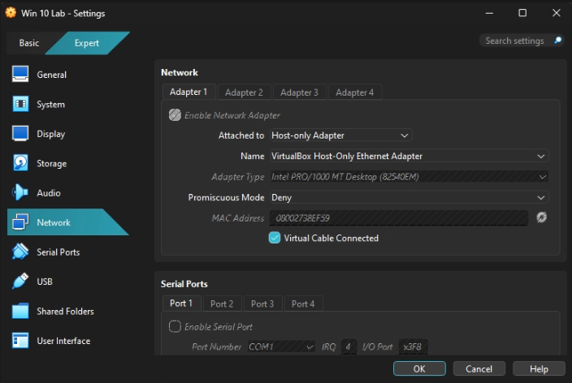
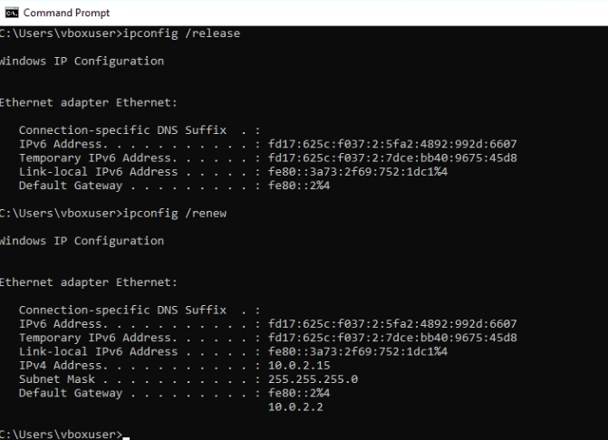

# Windows VM Lost Internet (VirtualBox)

## Objective
Restore internet connectivity for a Windows VM.

---

## Symptoms

- No internet access in browser
- `ping 8.8.8.8` failed

---

## Investigation

- Checked IP configuration
- Identified incorrect VirtualBox adapter setting (Host-Only)

---

## Root Cause
The VM was using a Host-Only adapter, which does not provide internet access.

---

## Resolution

- Switched adapter to NAT
- Renewed IP configuration

---

## Verification
- Internet access restored
- Successful ping to external IP

---

## Skills Demonstrated
- Network troubleshooting
- VirtualBox configuration
- Root cause analysis
